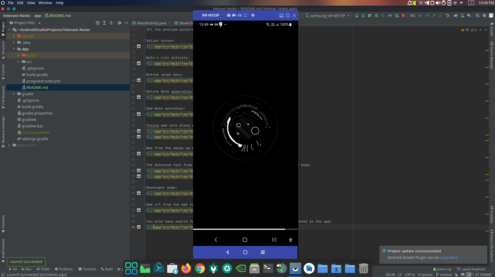

# Velorant-Notes
Improved version of notes taking application using SqlLite database added folder creation feature

You can download the apk of this project from the releases section

All the preview pictures are shown below:->

Splash screen:

Folder's list Activity:

Note's List Activity:

View note Activity:

Delete Note opearation:

Edit Note operation:

Add Note operation:

Edit name of the folder:

Delete folder operation:

Add a Folder operation:

